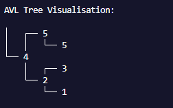

**CSC2103**

**Data Structures and Algorithms**

**Title :** 

**Implementation and Analysis of Self-Balancing Trees (AVL)Efficient Algorithm Design and Data Representation**

**Table Of Contents**

[**2.0 Implementation	3**](#_5sr7krlb4r2)**

[2.1 Self-Balancing Trees (AVL Tree)	3](#_sx1vn3qvbgx)

[Interface	3](#_9fp6vwoq33u1)

[Logic of Data Structure	6](#_y0iamc2fy5re)

[I. Classes	6](#_3xpbmq5bkn6k)

[II. AVL Tree Functions	8](#_8wzo2amizjtq)

[Input Accuracy of Example Data	12](#_ydtfwyxofrl)

[I. Scenario 1 (No duplicates)	12](#_70vf5l86pg6)

[II. Scenario 2 (With duplicates)	14](#_vchhcykokfmc)

[**4.0 Challenges	15**](#_csp8mxyalvwf)

[4.1  Self-Balancing Trees (AVL)	15](#_7atqcs522a33)

[4.2 Hashing (Open Addressing and Separate Chaining)	19](#_s9qvidzck13k)

# **2.0 Implementation**
This section displays the implementation of the Self-Balancing Tree (AVL) and Hashing (Open Addressing and Separate Chaining) programs created. 
## **2.1 Self-Balancing Trees (AVL Tree)**
### **Interface**

|Interface|Explanation|
| - | - |
||When the program is being executed, a menu is displayed for the user to input their desired operation.|
||
If the user chooses to insert a node, they can enter **'1'** to choose the insert operation then input the integer element they wish to add.

This process continues repeatedly until the user decides not to insert any more nodes.
|
||To display the AVL tree, the user needs to input  **'4'**. |
||If the user wants to search for a specific node that has been previously input, the program will print **'true'** if the node is present in the AVL tree. However, it will print **'false'** if it is not found.|
||Upon removing a node from the AVL tree, the tree will be automatically updated. When the user inputs **'4'**, they can observe the changes in the AVL tree.|
||
If the user selects **'5'**, they can choose to clear the entire AVL tree. Once the tree is cleared, if they subsequently choose **'4'** to display the tree, nothing will be printed as the tree is now empty.

|
### **Logic of Data Structure**

#### **I. Classes**

|Classes|Explanation|
| - | - |
|
Node Class

|
The Node class represents a node in the AVL tree. It includes the:

- left and right children of the node

- data of the current node

- height of the current node
|
|
AVL Tree Class

|The AVL Tree class represents the tree itself. It includes the logic to build the AVL tree and performs operations on the tree.|
|
Main Class

|
The Main class represents the main method of the AVL Tree Implementation program. It acts as the interface of the program and allows users to interact with the AVL tree. Users can choose to:

- Insert a value

- Delete a value

- Search for a value

- Display the tree

- Clear the tree

- Exit the program
|

#### **II. AVL Tree Functions**

|Functions / Methods|Explanation|
| - | - |
|
- AVL Tree initialization and deletion (Root Node)

|
A new AVL tree is formed by creating an empty node called “root”. The operations of the tree begins at the root or initial node.

The “makeEmpty” method clears the entire tree by resetting the value of the root node to null.
|
|
- Node Insertion

- Visual example, Insert 2

|
The insert method is used to insert data into the AVL tree through nodes when called..

Starting from the root node, each node is checked. If the node checked is empty (=null), the data would be inserted into the node of the tree. 

If the node checked is not empty, the input data to be inserted would be compared to the node's data. If the input data is less than or equal to the node's data, we go to the left child of the node and if it is greater than the node's data, we go to the right child instead. This checking logic is called recursively at each node from the top to bottom of the tree, until there is an empty node to insert the data.

After inserting the node, the height of the current node is updated. Based on the balance factor of the updated height, the tree would then be rebalanced starting from the current node if necessary.
|
|
- Node Deletion

|
The delete method is used to delete data from the AVL tree when called.

Similar to the insertion logic, each node is checked starting from the root node. If the data to be deleted (key) is less than or equal to the node's data, we go to the left child of the node and if it is greater than the node's data, we go to the right child instead. This checking logic is called recursively at each node from the top to bottom of the tree, until the node's data is equal to the key. If all nodes are checked and no equal data is found, it means the key is not found in the tree, so it returns null.

Once a node with data equal to the key is found, it will be the node to be deleted. If the node only has one child, the node is replaced with its child. But if the node has two children, we replace the node with the smallest value in the right subtree (the **most left child** of the right subtree).

After deleting the node, the height of the current node is updated and the tree would then be rebalanced if necessary.
|
|
- Rebalance Function 

|
The rebalance function is used to maintain the property of the self-balancing AVL Tree, by rotating the nodes so that their balance factor  is within [-1,+1].

When the tree is unbalanced, it will either perform a left or right rotation depending on the balance factor. After each rotation, the height and the balance factor of each node will be updated. The tree will continue to perform rotations until it is completely balanced.
|
|
- Search Function

|
Since the AVL tree is a binary search tree, it will search for the element in the tree by comparing it to each node from top to bottom. If the element to be search is lesser or equal to the node, it will continue the search in the left subtree and if the element is greater, it will continue to the right subtree.The function uses a loop to search each, as long as the node is not null and found is false.

If a node with the same value is found, it will return a true value, and if found remains false, the element is not in the current tree.
|
|
- Tree Traversal

|
This function displays the preorder, inorder, and postorder traversal of the AVL tree by printing the nodes in different sequences. The traversal sequence are as follows:

- Preorder Traversal

&emsp;- root → left → right  

- Inorder Traversal

&emsp;- left → root  → right

- Postorder Traversal

&emsp;- left → right → root 
|
|
- Print Tree

|
This is the logic used for printing the AVL tree, to provide the user with a visual representation of their data in a tree.

|
|- Import Scanner|The scanner class is imported from the java.util package to read the user's input in the interface.|
|
- Operation Selection 

|
An infinite while loop is used to display the operation interface to the user, until the user wishes to exit the program. With the help of switch cases, the user is able to choose to either insert and delete a node into the AVL tree, search the tree for an element, display the tree (both visual diagram and tree traversals), and clear the entire tree.

To prevent errors, this code segment also uses while loops to help ensure that the user only inputs data with a valid data type, which is integers.
|
### **Input Accuracy of Example Data**

#### **I. Scenario 1 (No duplicates)**

Input data: 50, 20, 45, 30, 65, 55, 15, 80, 70, 10 

|**Operations**|**Desired Output**|**Program Output**|
| - | - | - |
|Insert = [50, 20, 45, 30, 65, 55, 15, 80, 70, 10 ]|||
|Insert = 5|
Before balancing:-  After balancing:-

||
|Search = 7|7 is not in the tree ||
|Search = 50|||
|Delete = 70||

The output differs from the desired output because the program replaces the node to be deleted with the inorder successor, and then deletes the inorder successor. The desired output’s programs replaces the node with the inorder predecessor instead.
|
####
#### **II. Scenario 2 (With duplicates)**

Input data: 21, 19, 21, 5, 2, 12, 25, 30, 16

|**Operations**|**Desired Output**|**Program Output**|
| - | - | - |
|Insert = [21, 19, 21, 5, 2, 12, 25, 25, 30 ]|||
|Delete = 25|||
|Insert = 12||

The output differs from the desired output because the program inserts duplicate values into the left subtree instead of the right subtree.
|
|Search = 21|||

# **4.0 Challenges** 
This section displays the challenges of the Self-Balancing Tree (AVL) and Hashing (Open Addressing and Separate Chaining) programs created. 
## **4.1  Self-Balancing Trees (AVL)**

|No|Challenge|Description|Solution|
| - | - | - | - |
|1|Balance Maintenance|For every node, the height of the left and right subtrees must differ by at most one. Maintaining this balance during insertions and deletions are a challenge|
Our implementation handles this by implementing rotations. After each insertion or deletion, we compute the balance factor of each node. If the balance factor is greater than 1 or less than -1, the tree is deemed unbalanced. To correct this, we perform one of four types of rotations: LL, LR, RR, or RL, as implemented in the **rotateWithLeftChild** and **rotateWithRightChild** methods. The **rebalance** method further ensures the appropriate rotation is accomplished.

Diagram 1 : Snippet of code for Balance Maintenance 

|
|2|Deletion Management|Deletion in an AVL tree can be complex, especially in the event that the node that will be deleted has two children. This operation involves removing the node and reconfiguring the tree to maintain balance.|
Our implementation resolves this issue by implementing a recursive method. Upon finding the node to be deleted, the number of children is evaluated. If the node has two children, the in-order successor (the smallest node in the right subtree) is located. Then the node to be deleted is replaced with the in-order successor. Lastly, the in-order successor is deleted. This operation is guided by the **delete** and **mostLeftChild** methods.

Diagram 2 : Snippet of code for Deletion Management

|
|3|Efficient Search Operations|Searching for an element in an AVL tree can be inefficient if the tree is not balanced. If the AVL tree is not balanced, it may require a traversal of every node (O(n)).|
The self-balancing property of the AVL tree ensures successful search operations. By maintaining balance after each insertion or deletion, the AVL tree guarantees a logarithmic time complexity for search operations. This operation is executed by the **search** method.

Snippet of code : 

Diagram 3 : Snippet of code for Efficient Search Operations

|
|4|Tree Visualization|Visualising the structure of the AVL tree and its changes over time can be challenging. However, it is crucial for comprehension and debugging.|
We have addressed this challenge by implementing  **printTree** function, which provides a visual representation of the tree. By traversing the tree and printing nodes in a structured manner, the user can gain a visual understanding of the AVL tree’s changes over time.

Snippet of code : 

Diagram 4 : Snippet of code Tree Visualization
|
## **4.2 Hashing (Open Addressing and Separate Chaining)**

|No|Challenge|Explanation|Solution|
| :- | :- | :- | :- |
|1|Rigid data types|When designing the hashing programs, one challenge encountered is deciding the data type for the arrays and hash functions used. This is because the arrays and hash functions can only accept one type of data. For example, a hash function and array of type int will only accepts values that are integers. Values of String data types will not be recognized and will cause an error.|
One solution that was initially thought of was to design a hash function which uses control statements to identify the type of data inputted, and then call either a hash function that uses integer values or a hash function that uses String hashcodes. However, this solution proved to be inefficient as the program would take a longer time to perform the calculations and insertions. 

The solution that was used to solve this problem was to separate out the two types of data. The open addressing program deals solely with data of type int and the separate chaining deals only with data of type String. Hence, the user can choose which collision resolution program they want based on the type of data they are inserting. 
|
|2\. |Immutable hash table|
The program was  modified to allow users to keep inserting values via the insert method, as a way of implementing user interaction.

This however brought up another issue caused by the immutable nature of arrays. If the user kept inserting values into the hash table, it will eventually become full, and any values inserted after that will cause an error in the program. The challenge was to figure out how to allow users to insert more values into the table without causing a possible error in the program. 
|
The solution that was used to overcome this challenge is to design a resize method.

The purpose of the resize method is to resize the hash table to fit the possible new values while retaining all the old values inserted.

Thus, a resize function was created that creates a new array twice the size of the old array. The resize function also implements some calculations to rehash the old values into the new hash table. 

The resize function then updates the hash table to the new array and the size attribute to the new size

|

